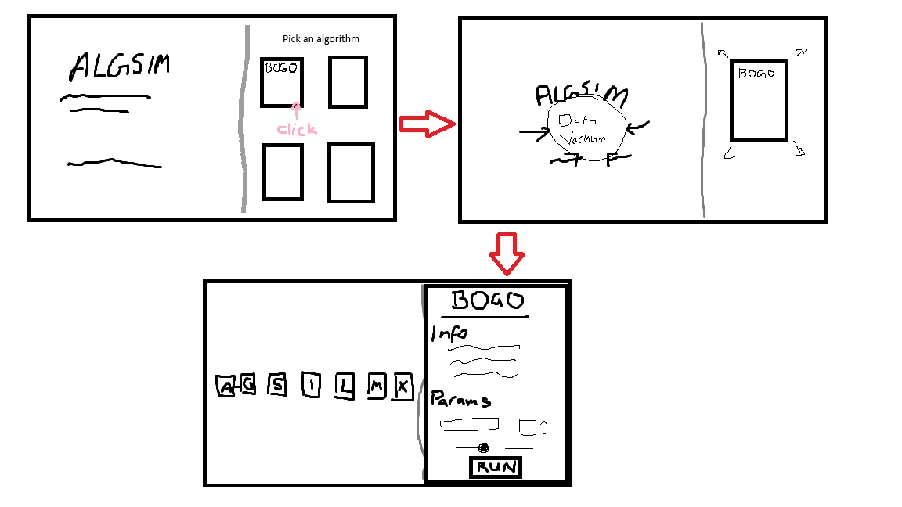

# Ideas and Thoughts

## Design ideas

### Website design scheme

- Could do a minimal white background/black text website with pops of colour. This is something I do often though and I want to challenge myself a bit
- Could go the other way, and do a dark background (black or dark grey) with white writing. I would want to include more colours (eg any buttons and shapes on the website)
- Could do a dark green, tech inspired look. Try to build some sort of nature into it

I think from all of the ideas I like the dark grey background with pops of colour throughout the best. 

### Website layout

- As I have done on clicking game, I could have everything centred. Have a big title in the centre, with options to choose algorithms/search under the title
- Another idea I like is to divide the screen with a vertical line. This idea is for the functionality of the website, as I could have the visualisation of an algorith on the left in a larger area, and have the information/parameters on the right in a smaller area. I am just not sure how this would look as the landing screen, because I think it would make sense to have all the information in the larger left block.
However, I could split it having the title and website details on the left, and then on the right have the algorithm selection.

### Visual WOW

- Currently I have the idea that algorithms will be displayed on little cards. When you select an algorithm to run, the card will expand and take up the right hand panel of the website. So at the top of the card before selecting it, it will have the title. This title will then just naturally expand into the right panel. In addition to this, I think it would be really cool to use the characters that are on the homescreen as part of the data, and these characters can get 'vacuumed' towards the left panel where the visualisation will appear.  Below is the idea I think I want to run with  The user can change the data types if they want to not use letters. They can change this in the params section.

## Code ideas

### Breaking down the design into code

- The left and right panels will be two comps/divs